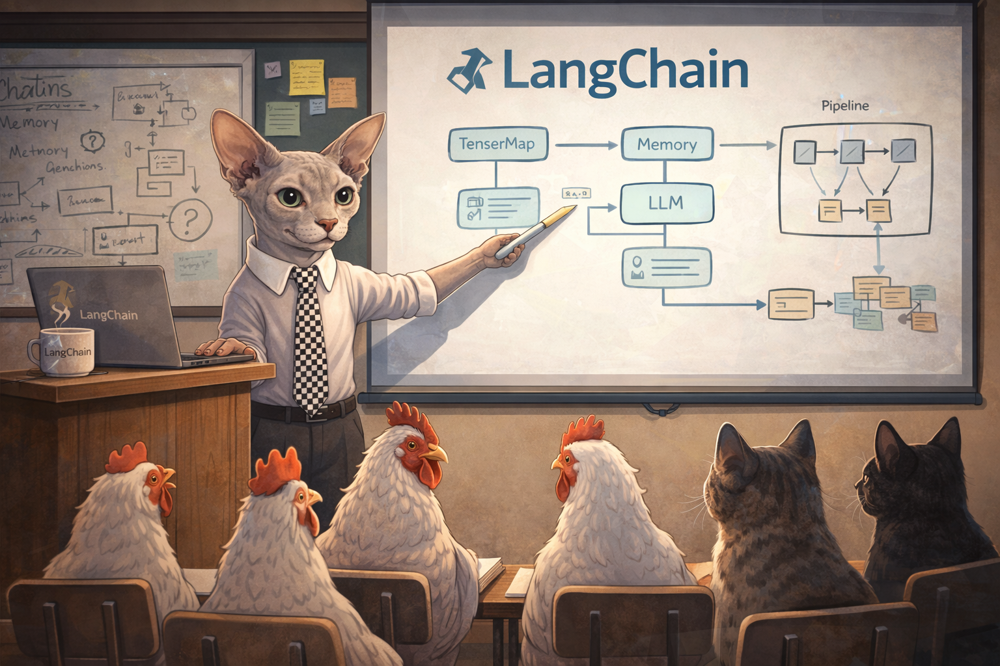

# Chain Exercises



A collection of Python projects for learning LangChain, LangGraph, and related frameworks.

This repository is not a formal "lessons" course or curriculum.
These are standalone projects I used to learn specific aspects of the stack in practice.

## Projects

| Project | Description | Requirements |
|---------|-------------|-------------|
| [langgraph-research](langgraph-research/) | Iterative web research agent — plans queries, searches with Tavily, evaluates results, synthesizes an answer. Includes search dedup, markdown export, and user feedback loop. | OpenAI API key, Tavily API key |
| [langgraph-qna](langgraph-qna/) | Document Q&A pipeline — loads local markdown/text files, chunks them, retrieves relevant passages by keyword, and answers questions with cited sources. | OpenAI API key |
| [langgraph-debate](langgraph-debate/) | Multi-agent debate — Pro and Con LLM agents argue a proposition across multiple rounds while a Judge scores and declares a winner. | OpenAI API key |
| [langgraph-chat](langgraph-chat/) | Interactive chat agent — conversational LLM with in-memory checkpointing, iterative refinement, conversation summarization, and history listing. | OpenAI API key |
| [langgraph-chat-fastio-memory](langgraph-chat-fastio-memory/) | Interactive chat agent with Fast.io MCP-backed long-term memory (facts/preferences persisted in cloud files across sessions). | OpenAI API key, Fast.io API key |

## Testing

Install test tooling once:

```bash
pip install -r requirements-test.txt
```

Run all section test suites:

```bash
./run-tests.sh
```

Run a specific section:

```bash
cd langgraph-chat && pytest -q
cd langgraph-debate && pytest -q
cd langgraph-qna && pytest -q
cd langgraph-research && pytest -q
```
