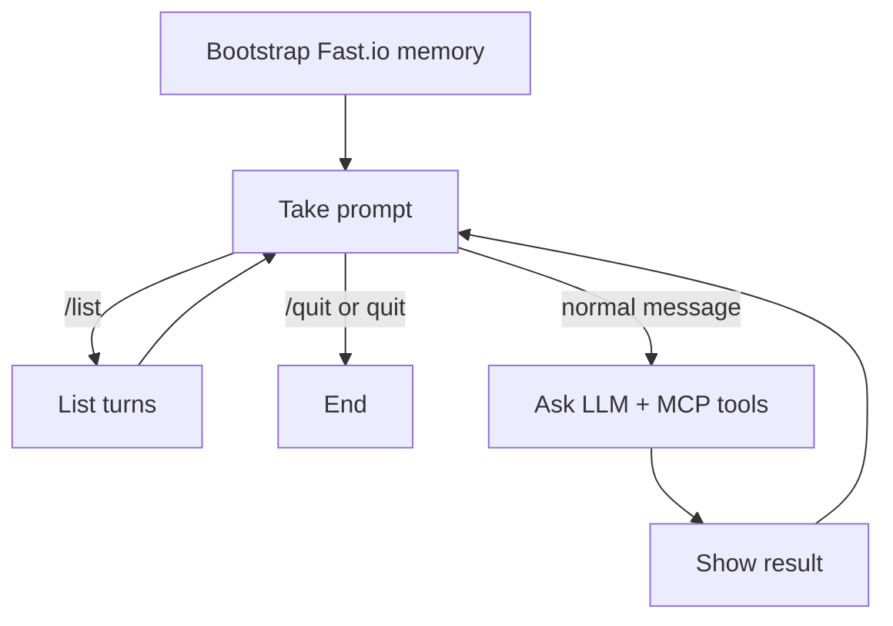

# LangGraph Chat + Fast.io MCP Memory

Interactive chat agent (LangGraph) with long-term memory stored in Fast.io through MCP.

This exercise behaves like `langgraph-chat`, but it adds persistent memory:
- Every new session bootstraps by reading memory from Fast.io
- You can ask it to remember facts/preferences
- Future sessions can recall what was stored

## Context

This is a learning project, not a full memory platform. It is a working example focused
on combining a simple chat loop with MCP-based cloud file memory.

What this project demonstrates:
- MCP tool integration from a LangGraph chat flow
- Session bootstrap against remote memory state
- Durable read/write memory behaviors across sessions
- Practical handling of tool-schema compatibility issues

## Workflow



## Project Structure

```text
langgraph-chat-fastio-memory/
├── chat_fastio_memory.py   # Entry point
├── graph.py                # LangGraph wiring + routing
├── state.py                # State + env-backed config
├── agent_runtime.py        # MCP client + memory-aware agent calls
├── requirements.txt
├── run.sh
├── .env.example
└── nodes/
    ├── bootstrap_memory.py # Session startup memory bootstrap
    ├── take_prompt.py
    ├── ask_agent.py
    ├── show_results.py
    └── list_history.py
```

## Setup

1. Copy env file:

   ```bash
   cp .env.example .env
   ```

2. Set required keys in `.env`:

   ```bash
   OPENAI_API_KEY=...
   FASTIO_API_KEY=...
   ```

3. Run:

   ```bash
   chmod +x run.sh
   ./run.sh
   ```

## Memory Commands

You can use normal language ("remember that I like dark roast coffee"), or explicit commands:

- `/remember <text>`: store fact/preference
- `/recall` or `/memory`: retrieve stored memory
- `/forget <text>`: remove/mark a memory item
- `/list`: show chat turn history without calling the LLM
- `/quit` or `quit`: end the interactive session

## Fast.io MCP Notes

- Default MCP endpoint: `https://mcp.fast.io/mcp`
- Default transport in this exercise: `streamable_http`
- Memory target defaults:
  - workspace: `langgraph-chat-memory`
  - file: `facts_and_preferences.md`
- Default excluded tool list: `FASTIO_EXCLUDE_TOOLS=org,workspace`
  - This avoids known OpenAI function-schema incompatibilities from some MCP tools.
- Runtime fallback: if OpenAI rejects a tool schema at call time, the agent auto-excludes
  that tool and retries.

These can be overridden in `.env`.
