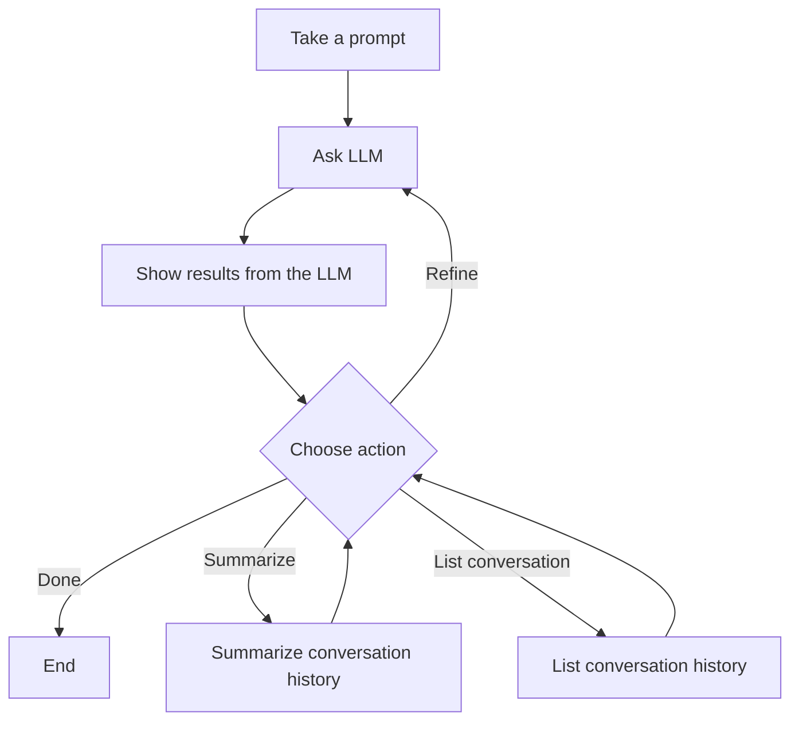

# LangGraph Chat Agent

An interactive conversational chatbot built with LangGraph and in-memory checkpointing.
Ask a question, get an answer, then iteratively refine your query, summarize the conversation,
or review the full history.

## Workflow



## Project Structure

```
langgraph-chat/
├── chat.py              # Entry point — logging, token tracking, invokes graph
├── graph.py             # Graph construction with MemorySaver + conditional routing
├── state.py             # ChatState TypedDict + MODEL_NAME config
├── requirements.txt     # Python dependencies
├── run.sh               # Setup venv + run script
├── plan.md              # Design plan with Mermaid diagram
├── README.md            # This file
├── logs/                # Structured JSON logs (created at runtime)
└── nodes/
    ├── __init__.py      # Re-exports all node functions
    ├── take_prompt.py   # Node A — gets initial question from user
    ├── ask_llm.py       # Node B — sends query + history to LLM
    ├── show_results.py  # Node C — displays the LLM response
    ├── choose_action.py # Node D — action menu (Done/Refine/Summarize/List)
    ├── summarize.py     # Node E — LLM summarizes conversation history
    └── list_history.py  # Node F — prints all conversation turns
```

## Setup

1. Create a `.env` file with your OpenAI API key:
   ```
   OPENAI_API_KEY=sk-...
   ```

2. Run the agent:
   ```bash
   chmod +x run.sh
   ./run.sh
   ```

   This will create a virtual environment, install dependencies, and start the chat agent.

## Configuration

Edit `state.py` to change:
- `MODEL_NAME` — the OpenAI model to use (default: `gpt-4o-mini`)

## How It Works

1. **Enter a question** — the agent prompts you for your initial query
2. **LLM responds** — the question (with any prior conversation context) is sent to the LLM
3. **Choose what to do next:**
   - **Done** — end the session and see token usage
   - **Refine** — ask a follow-up question (loops back to the LLM with full history)
   - **Summarize** — the LLM produces a summary of the entire conversation, then choose again
   - **List** — see all conversation turns at a glance, then choose again

### Key Behavior

- **Refine** sends the full conversation history to the LLM, so follow-up questions have context
- **Summarize** and **List** are informational — they don't add to the conversation history
- **MemorySaver** provides in-memory checkpointing (state preserved within the session)

## Requirements

- Python 3.10+
- OpenAI API key
- Dependencies: `langgraph`, `langchain-community`, `langchain-openai`, `python-dotenv`
