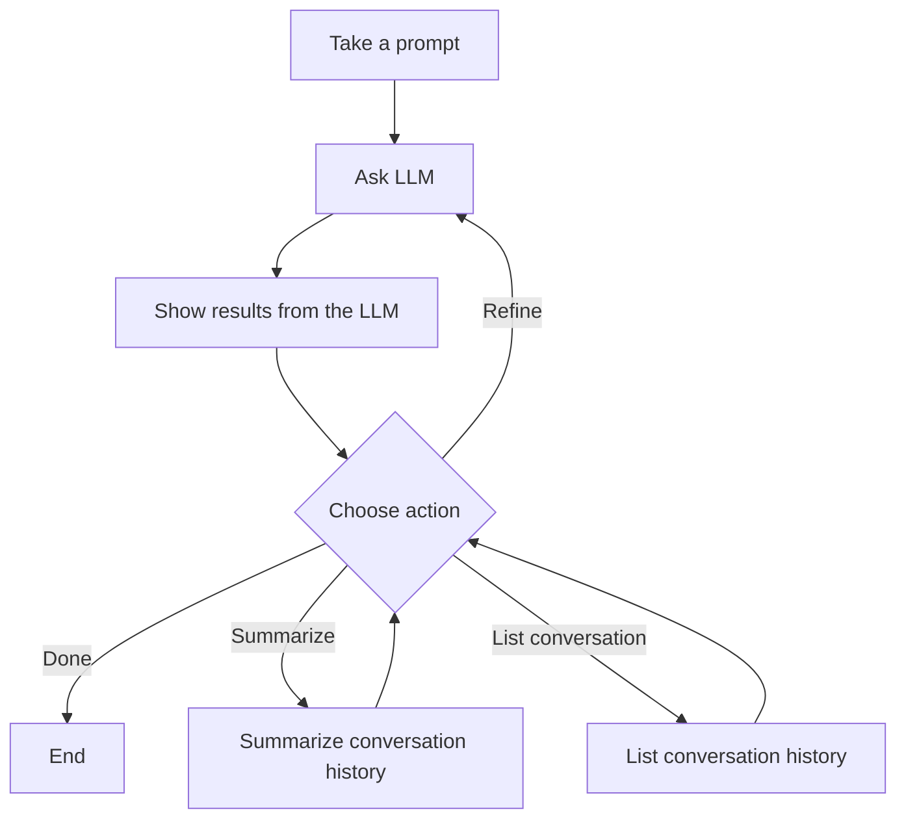

# LangGraph Chat Agent — Plan

## Overview

Interactive conversational chatbot using LangGraph with in-memory checkpointing (`MemorySaver`).
The user asks a question, the LLM responds, and the user can iteratively refine their query,
summarize the conversation, or list all turns.

## Workflow



## Nodes

| Node | File | Description |
|------|------|-------------|
| A — Take Prompt | `nodes/take_prompt.py` | Gets initial question from user via `input()` |
| B — Ask LLM | `nodes/ask_llm.py` | Sends system prompt + full history + current query to LLM |
| C — Show Results | `nodes/show_results.py` | Displays the LLM response with formatting |
| D — Choose Action | `nodes/choose_action.py` | Menu: Done / Refine / Summarize / List |
| E — Summarize | `nodes/summarize.py` | LLM summarizes the full conversation history |
| F — List History | `nodes/list_history.py` | Prints all conversation turns numbered |

## State

```python
class ChatState(TypedDict):
    query: str          # current user question or refinement
    response: str       # latest LLM response
    history: list[dict] # conversation turns [{query, response}, ...]
    action: str         # user's chosen action (done/refine/summarize/list)
    summary: str        # transient summary output
```

## Key Decisions

- **Summarize and List are not remembered** — only the ask_llm node appends to history (they are informational views that loop back to the action menu)
- **Both Summarize and List loop back** — after displaying their output, users return to the action menu to continue
- **MemorySaver** used for learning the checkpointing pattern (in-memory, no persistence)
- **History as list of dicts** — ask_llm converts to HumanMessage/AIMessage for LLM context
- **No external APIs** — pure OpenAI chat, no web search
