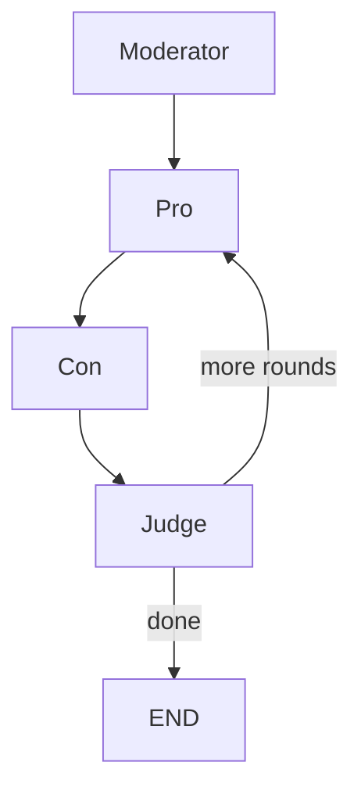

# Multi-Agent Debate

A LangGraph application where multiple LLM agents argue for and against a proposition
across multiple rounds, with a judge scoring each round and declaring a winner.

## What You'll Learn

- Running multiple LLM personas with different system prompts and temperatures
- Round-based looping with conditional routing (judge decides when to stop)
- Accumulating state across iterations (round history, scores)
- Structured output parsing (extracting scores from judge responses)

## Project Structure

```
langgraph-debate/
├── debate.py             # Main entry point
├── state.py              # DebateState + config constants
├── graph.py              # Graph wiring + round routing
├── nodes/
│   ├── moderator.py      # Frames topic as a debatable proposition
│   ├── pro.py            # Argues FOR the proposition
│   ├── con.py            # Argues AGAINST the proposition
│   └── judge.py          # Scores rounds, decides continue/done, final verdict
├── personas/
│   ├── pro_southern_lawyer.md   # Flamboyant Southern trial lawyer
│   ├── con_vinny.md             # Unconventional Brooklyn street lawyer
│   └── judge_judy.md            # No-nonsense TV judge
├── docs/
│   ├── hotdog-1.md      # Sample run — no personas (dry)
│   └── hotdog-2.md      # Sample run — with personas (entertaining)
├── requirements.txt
├── run.sh
└── README.md
```

## Workflow



1. **Moderator** — Runs once. Takes the raw topic and frames it as a clear, debatable proposition.
2. **Pro** — Argues FOR the proposition. In later rounds, addresses Con's previous points.
3. **Con** — Argues AGAINST. Directly rebuts Pro's current argument.
4. **Judge** — Scores both sides 1-10, writes commentary. After the last round, produces a final verdict with winner and reasoning.

## Node Details

### Moderator (`nodes/moderator.py`)
- Converts a vague topic into a crisp proposition
- Example: "AI in schools" → "AI should be the primary tool for grading student essays"
- Runs once at the start, then the graph moves to the debate loop

### Pro (`nodes/pro.py`)
- Temperature 0.7 for creative variety
- Round 1: delivers an opening argument
- Round 2+: builds on earlier points and counters Con's previous arguments
- Gets full history of previous rounds for context

### Con (`nodes/con.py`)
- Temperature 0.7
- Always sees Pro's current-round argument to directly counter it
- Has access to the full round history
- Focuses on dismantling Pro's specific claims

### Judge (`nodes/judge.py`)
- Temperature 0 for consistent, deterministic scoring
- Parses structured output: `PRO_SCORE`, `CON_SCORE`, `COMMENTARY`
- After the final round, produces `WINNER` and `REASON` via a separate LLM call
- Routing: `_done=True` → END, otherwise → back to Pro for next round

## Personas

By default the debate is functional but dry — every debater sounds like a polite academic
exchange. To liven things up, each node loads a persona from the `personas/` directory
at startup and injects it into the system prompt.

| Agent | Persona | File |
|-------|---------|------|
| Pro | Flamboyant Southern trial lawyer — folksy metaphors, "bless your heart," slow sermon crescendos | `personas/pro_southern_lawyer.md` |
| Con | Brooklyn street-smart Vinny Gambini type — unconventional, occasionally naive, accidentally brilliant | `personas/con_vinny.md` |
| Judge | Judge Judy — impatient, withering, delivers verdicts like court orders | `personas/judge_judy.md` |

Persona files are plain markdown. Edit them freely — no Python changes needed.

### Before and After

Both runs used the same topic: *"Is a hot dog a sandwich?"*

**Without personas** (`docs/hotdog-1.md`) — technically correct, but every argument
sounds like a law school exam answer:

> *Ladies and gentlemen, the proposition before us is straightforward yet often misunderstood:
a hot dog is a type of sandwich. At its core, a sandwich is defined by its structure...*
>
> Judge Round 1: Pro 8/10, Con 8/10 — *Both sides present strong arguments with credible
definitions and cultural context.*

**With personas** (`docs/hotdog-2.md`) — same logic, considerably more entertaining:

> *Well now, if it please the court, let me begin with a plain truth as steady as a church
bell on Sunday mornin'... if a sub, a po' boy, or a meatball grinder can ride under the
sandwich banner, then a hot dog, perched noble as a crow on a fencepost, belongs in that
same family.*
>
> *Whoa, whoa, hold on there, Counselor — you can't just wave your hands and say "filling
between bread" like dat solves everythin'. By that logic, a taco's a sandwich, a burrito's
a sandwich, and a slice of lasagna is just a real committed sandwich if you squint hard
enough.*
>
> Judge Final Verdict: *Don't pee on my leg and tell me it's raining. Con wins.*

## Configuration

Edit `state.py` to adjust:

| Setting | Default | Description |
|---------|---------|-------------|
| `MODEL_NAME` | `gpt-5.4-mini` | OpenAI model |
| `MAX_ROUNDS` | `3` | Maximum debate rounds |
| `PRO_TEMPERATURE` | `0.7` | Creativity for Pro agent |
| `CON_TEMPERATURE` | `0.7` | Creativity for Con agent |
| `JUDGE_TEMPERATURE` | `0` | Deterministic judge scoring |

## Setup

```bash
# From this directory:
./run.sh "Python vs JavaScript for backend development"

# Or interactively:
./run.sh
# → Enter a debate topic: AI replacing teachers
```

Requires a `.env` file:
```
OPENAI_API_KEY=sk-...
```

## Example Output

```
────────────────────────────────────────────────────────────
Debate: Python vs JavaScript for backend development
Max rounds: 3
────────────────────────────────────────────────────────────

[Moderator] Proposition:
  "Python is a superior choice to JavaScript for backend web development."

════════════════════════════════════════════════════════════
[Pro] Round 1
Python's rich ecosystem of frameworks like Django and FastAPI, combined with
its clean syntax, makes it the clear winner for backend development...

[Con] Round 1
While Python has excellent frameworks, JavaScript's Node.js offers unmatched
performance for I/O-heavy applications and enables full-stack development...

[Judge] Round 1: Pro 7/10, Con 8/10
  Con effectively countered with Node.js performance advantages.

════════════════════════════════════════════════════════════
[Pro] Round 2
...

[Con] Round 2
...

[Judge] Round 2: Pro 8/10, Con 7/10
  Pro made strong data science ecosystem arguments.

════════════════════════════════════════════════════════════
[Pro] Round 3
...

[Con] Round 3
...

[Judge] Final Verdict (Pro 22 vs Con 22):
WINNER: Con
REASON: While the scores are tied, Con demonstrated stronger practical arguments
about full-stack consistency and the npm ecosystem breadth...

────────────────────────────────────────────────────────────
Debate complete.
  Rounds: 3
  Round 1: Pro 7/10, Con 8/10
  Round 2: Pro 8/10, Con 7/10
  Round 3: Pro 7/10, Con 7/10
```

## Testing

From this directory:

```bash
pip install -r ../requirements-test.txt
pytest -q
```

This runs unit tests for judge score parsing and final-verdict flow.

## Ideas to Extend

- **Audience node** — A fourth agent that votes after each round
- **Fact-checker** — Use Tavily search to verify claims made by debaters
- **Export** — Save debate transcript to markdown (like langgraph-research)
- **Dynamic rounds** — Let the judge end early if one side is clearly winning
- **Multiple debaters** — 2v2 panel format with different specialist personas
