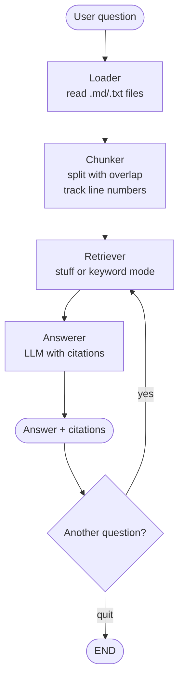

# LangGraph Document Q&A

Question-answering pipeline using LangGraph that loads local documents, chunks them, and answers questions with file:line citations.

## Project Structure

```
langgraph-qna/
├── qna.py                # Main entry point (interactive question loop)
├── state.py              # State definition and configuration
├── graph.py              # Graph construction
├── nodes/
│   ├── __init__.py
│   ├── loader.py         # Loads .md/.txt files from docs/
│   ├── chunker.py        # Splits documents into chunks with line tracking
│   ├── retriever.py      # Finds relevant chunks (stuff or keyword mode)
│   └── answerer.py       # LLM generates answer with citations
├── docs/                 # Sample documents to query against
│   ├── python_data_structures.md
│   ├── http_status_codes.md
│   └── git_commands.md
├── logs/                 # Structured JSON logs (git-ignored)
├── requirements.txt
├── run.sh
├── .env                  # API keys (not committed)
└── README.md
```

## Configuration

Edit [state.py](state.py) to configure:

- **`MODEL_NAME`** (default: `"gpt-5.4-mini"`) — OpenAI model for answering
- **`DOC_DIR`** (default: `"docs"`) — Directory to load documents from
- **`CHUNK_SIZE`** (default: `500`) — Target characters per chunk
- **`CHUNK_OVERLAP`** (default: `50`) — Overlap characters between chunks
- **`RETRIEVAL_MODE`** (default: `"keyword"`) — Retrieval strategy:
  - `"stuff"`: Pass all chunks to the LLM (works for small document sets)
  - `"keyword"`: Score chunks by keyword overlap, return top-K
- **`TOP_K`** (default: `5`) — Number of chunks to retrieve in keyword mode

## Workflow



### Loader

**File**: [nodes/loader.py](nodes/loader.py)

Walks the `docs/` directory and reads all `.md` and `.txt` files. Skips hidden directories, `venv/`, and `__pycache__/`. Stores each file's content and line count.

### Chunker

**File**: [nodes/chunker.py](nodes/chunker.py)

Splits each document into overlapping chunks with line number tracking. Chunks target ~500 characters with configurable overlap. Each chunk records its source file and start/end line numbers for citations.

### Retriever

**File**: [nodes/retriever.py](nodes/retriever.py)

Selects relevant chunks for the question. Two modes:

- **Stuff mode**: Passes all chunks to the answerer. Simple and effective for small document sets.
- **Keyword mode**: Extracts keywords from the question (filtering stop words), scores chunks by keyword overlap, and returns the top-K matches.

This is the component that gets swapped when upgrading to a vector database — same interface, smarter scoring.

### Answerer

**File**: [nodes/answerer.py](nodes/answerer.py)

Uses an LLM to generate an answer from the retrieved chunks. The system prompt instructs the model to use ONLY the provided context and cite sources as `[filename:start_line-end_line]`. If no relevant chunks are found, it says so honestly rather than hallucinating.

## Features

- **Interactive question loop** — Load documents once, then ask multiple questions without reloading
- **File:line citations** — Answers cite exact source locations like `[git_commands.md:45-60]`
- **Two retrieval modes** — "stuff" for small corpora, "keyword" for targeted retrieval
- **Structured logging** — JSON logs written to `logs/` for debugging
- **Colorful terminal output** — Each node prints its progress in a distinct color
- **Vector DB upgrade path** — Designed so swapping in embeddings + similarity search is minimal effort

## Setup

### Prerequisites

- Python 3.8 or higher
- OpenAI API key

### 1. Create a Virtual Environment

```bash
python3 -m venv venv
source venv/bin/activate
```

### 2. Install Dependencies

```bash
pip install -r requirements.txt
```

### 3. Set Up API Key

Create a `.env` file:

```bash
OPENAI_API_KEY=your_openai_api_key_here
```

### 4. Add Your Documents

Place `.md` or `.txt` files in the `docs/` directory. Three sample files are included to get started.

### 5. Run

```bash
./run.sh
```

Or manually:
```bash
source venv/bin/activate
python qna.py
```

## Example

```
Loading documents from: docs/
[Loader]    Loaded 3 files (8,245 chars total)
[Chunker]   Created 22 chunks from 3 files

Ask a question (or 'quit' to exit): What is a deque and when should I use one?

[Retriever] Selected 5/22 chunks (keyword mode)
[Answerer]  Answer written (5 chunks used)

──────────────────────────────────────────────────────────
A deque (double-ended queue) is a data structure from Python's `collections`
module that is optimized for appending and popping from both ends in O(1) time
[python_data_structures.md:95-108]. You should use a deque instead of a list
when you need a queue or need frequent operations on both ends of a sequence.
──────────────────────────────────────────────────────────

Ask another question (or 'quit' to exit): What's the difference between 401 and 403?

[Retriever] Selected 5/22 chunks (keyword mode)
[Answerer]  Answer written (5 chunks used)

──────────────────────────────────────────────────────────
401 Unauthorized means the client is not authenticated — "Who are you?"
403 Forbidden means the client is authenticated but not authorized — "I know
who you are, but you can't do that." [http_status_codes.md:76-80]
──────────────────────────────────────────────────────────

Ask another question (or 'quit' to exit): quit
Done!
```
