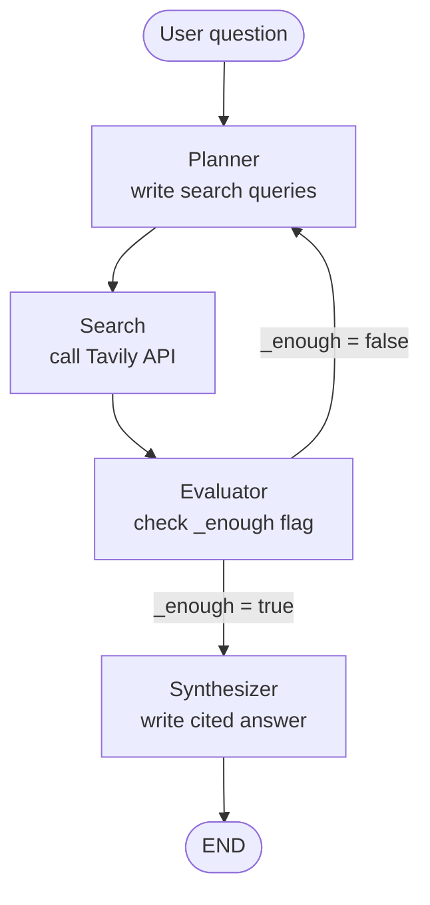

# LangGraph Research

Research agent workflow using LangGraph that intelligently searches the web and synthesizes answers with citations.

## Project Structure

```
langgraph-research/
├── research-py.py       # Main entry point
├── state.py            # State definition and configuration
├── tools.py            # External tools (Tavily search)
├── graph.py            # Graph construction and routing
├── nodes/              # Individual node implementations
│   ├── __init__.py
│   ├── planner.py      # Plans search queries
│   ├── search.py       # Executes searches
│   ├── evaluator.py    # Evaluates if enough info
│   └── synthesizer.py  # Writes final answer
├── requirements.txt
├── .env               # API keys (not committed)
└── README.md
```

## Configuration

Edit [state.py](state.py) to configure:

- **`MODEL_NAME`** (default: "gpt-5.4-nano") - OpenAI model to use for all LLM calls
- **`MAX_ITERATIONS`** (default: 3) - Safety cap on search loops
- **`MIN_RESULTS`** (default: 6) - Minimum results for simple evaluation
- **`LLM_EVALUATION`** (default: True) - Use LLM to evaluate vs simple count
  - When `True`: Uses an LLM call to intelligently decide if enough info is gathered
  - When `False`: Uses simple heuristics (min result count + iteration limit)

## Workflow



## Setup

### Prerequisites

- Python 3.8 or higher
- OpenAI API key
- Tavily API key (free tier available at [tavily.com](https://tavily.com))

### 1. Create a Virtual Environment

```bash
# Create virtual environment
python3 -m venv venv

# Activate it
# On Linux/Mac:
source venv/bin/activate
# On Windows:
# venv\Scripts\activate
```

### 2. Install Dependencies

```bash
pip install -r requirements.txt
```

Or install individually:
```bash
pip install langgraph langchain-openai tavily-python python-dotenv
```

### 3. Set Up API Keys

Create a `.env` file in this directory with your API keys:

```bash
cp .env.example .env
```

Then edit `.env` and add your actual API keys:

```bash
OPENAI_API_KEY=your_openai_api_key_here
TAVILY_API_KEY=your_tavily_api_key_here
```

**Getting API Keys:**

- **OpenAI**: Sign up at [platform.openai.com](https://platform.openai.com) and create an API key
- **Tavily**: Register at [tavily.com](https://tavily.com) for a free API key (1,000 searches/month on free tier)

### 4. Run the Agent

**Option A: Using the run script (easiest)**

```bash
./run.sh
```

The script will automatically:
- Create the virtual environment (if needed)
- Activate it
- Install dependencies
- Run the agent

**Option B: Manual run**

```bash
# Make sure venv is activated first
source venv/bin/activate

# Run the agent
python research-py.py
```

You'll be prompted to enter a research question. The agent will:
1. Plan search queries based on your question
2. Search the web using Tavily
3. Evaluate if enough information has been gathered
4. Loop back for more searches if needed
5. Synthesize a final answer with citations

## Example

```
Research question: What are the main differences between LangGraph and LangChain?

[Planner] Iteration 1 — queries: ['LangGraph vs LangChain comparison', ...]
[Search]  Got 9 new results
[Evaluator] 9 results, iteration 1 — enough? yes
[Synthesizer] Answer written.

[Final answer with citations appears here]
```