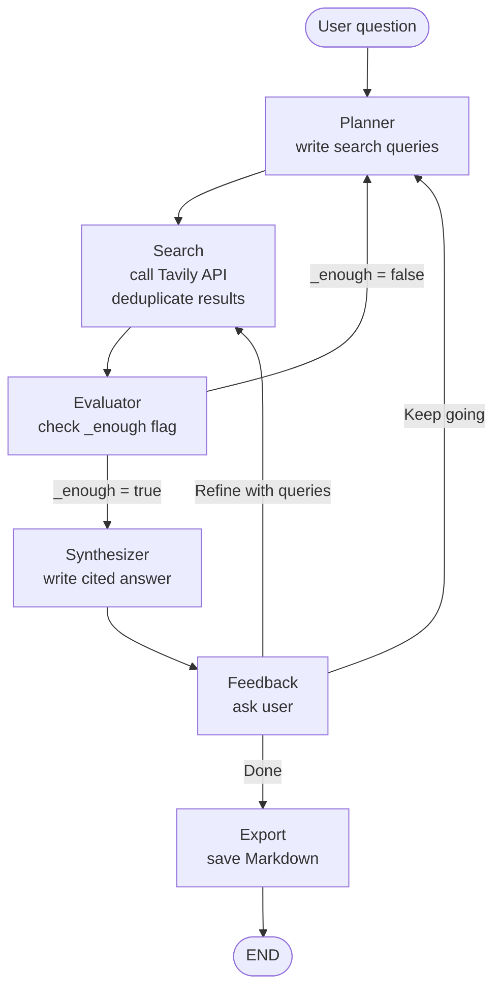

# LangGraph Research


Research agent workflow using LangGraph that intelligently searches the web and synthesizes answers with citations.

## Context

This is a learning project, not a production research assistant. It is a working example
for iterative search-and-synthesis patterns with explicit graph state transitions.

What this project demonstrates:
- Planner/search/evaluator loops with termination controls
- Search result accumulation and URL deduplication
- LLM-based sufficiency checks before synthesis
- User feedback routing and markdown export

## Project Structure

```
langgraph-research/
├── research-py.py       # Main entry point
├── state.py            # State definition and configuration
├── tools.py            # External tools (Tavily search)
├── graph.py            # Graph construction and routing
├── nodes/              # Individual node implementations
│   ├── __init__.py
│   ├── planner.py      # Plans search queries
│   ├── search.py       # Executes searches (with dedup)
│   ├── evaluator.py    # Evaluates if enough info
│   ├── synthesizer.py  # Writes final answer
│   ├── feedback.py     # User feedback loop
│   └── export.py       # Markdown export
├── logs/               # Structured JSON logs (git-ignored)
├── answers/            # Exported Markdown answers (git-ignored)
├── requirements.txt
├── .env               # API keys (not committed)
└── README.md
```

## Configuration

Edit [state.py](state.py) to configure:

- **`MODEL_NAME`** (default: "gpt-5.4-nano") - OpenAI model to use for all LLM calls
- **`MAX_ITERATIONS`** (default: 3) - Safety cap on search loops
- **`MIN_RESULTS`** (default: 6) - Minimum results for simple evaluation
- **`LLM_EVALUATION`** (default: True) - Use LLM to evaluate vs simple count
  - When `True`: Uses an LLM call to intelligently decide if enough info is gathered
  - When `False`: Uses simple heuristics (min result count + iteration limit)

## Workflow



### Init

The graph starts with an initial `ResearchState`:
- **`query`**: User's research question
- **`search_queries`**: Empty list (populated by Planner)
- **`results`**: Empty list (accumulated by Search)
- **`seen_urls`**: Empty set (tracks URLs for deduplication)
- **`iteration`**: 0 (incremented after each search)
- **`final_answer`**: Empty string (written by Synthesizer)
- **`_enough`**: False (set by Evaluator to control loop)

Entry point is the **Planner** node, which kicks off the research loop.

### Planner

**File**: [nodes/planner.py](nodes/planner.py)

The Planner uses an LLM to analyze the research question and decide what to search for. On the first iteration, it generates 1-3 focused search queries based purely on the question. On subsequent iterations, it reviews the last 6 search results and identifies information gaps, generating new queries to fill those gaps.

**Key behavior**:
- System prompt: "You are a research planner... output 1-3 short, specific search queries"
- Returns cleaned query strings (strips bullets, numbers, etc.)
- Updates `search_queries` in state for the Search node to execute

### Search

**File**: [nodes/search.py](nodes/search.py)

The Search node executes all queries from the Planner using the Tavily API (via `tools.search_web`). It deduplicates results by URL, so the same page is never added twice even across multiple search iterations. Purely functional—no LLM calls here, just API interaction.

**Key behavior**:
- Takes `state["search_queries"]` list
- Calls Tavily API for each query
- Deduplicates results against `seen_urls` — skips any URL already collected
- Appends only new results to `state["results"]`
- Increments `state["iteration"]` counter
- Each result contains: `title`, `url`, `content`

### Evaluator

**File**: [nodes/evaluator.py](nodes/evaluator.py)

The Evaluator decides whether to continue searching or move to synthesis. It has two modes controlled by the `LLM_EVALUATION` config flag:

**LLM Mode** (`LLM_EVALUATION = True`):
- Sends the question + first 10 results to an LLM
- LLM responds "YES" if enough info, or "NO - <reason>" if more research needed
- More intelligent but uses an extra API call per iteration

**Simple Mode** (`LLM_EVALUATION = False`):
- Just checks: `len(results) >= MIN_RESULTS`
- Faster and cheaper, but less intelligent

**Safety**: Always stops at `MAX_ITERATIONS` regardless of mode.

**Key behavior**:
- Sets `state["_enough"] = True/False`
- This flag controls the conditional edge routing

### Synthesizer

**File**: [nodes/synthesizer.py](nodes/synthesizer.py)

The Synthesizer reads all accumulated search results and writes a comprehensive, cited answer. It uses an LLM to synthesize information across all sources.

**Key behavior**:
- System prompt: "Write a clear, thorough answer... Cite sources with [1], [2]... End with a 'Sources' section"
- Includes the first 400 chars of each result's content for context
- Writes the final answer to `state["final_answer"]`
- After this node, the graph moves to **Feedback**

### Feedback

**File**: [nodes/feedback.py](nodes/feedback.py)

After synthesis, the user is presented with the answer and given three options:

1. **Done** — Accept the answer and proceed to export
2. **Keep going** — The agent loops back to the Planner to automatically search for more information based on gaps it identifies
3. **Refine** — The user provides their own search guidance (e.g. "focus on performance benchmarks"). These queries go directly to the Search node, skipping the Planner

**Key behavior**:
- Interactive prompt with 3 choices
- Option 2 sets `_enough = False`, routes back to Planner
- Option 3 injects user queries into `search_queries` and routes directly to Search
- Option 1 (or any other input) sets `_enough = True`, routes to Export

### Export

**File**: [nodes/export.py](nodes/export.py)

Saves the final answer to a well-formatted Markdown file in the `answers/` directory (git-ignored).

**Output format**:
- Heading: the original research question
- Metadata: timestamp, iteration count, result count
- Full answer with citations
- Numbered source list with clickable links

**Key behavior**:
- Files named `answers/YYYYMMDD_HHMMSS_<slug>.md`
- Slug is derived from the first few words of the question
- Deduplicates sources by URL in the source list
- After this node, the graph reaches `END`

## Features

- **Iterative research loop** — Planner → Search → Evaluate cycle runs automatically until enough information is gathered
- **LLM-powered evaluation** — Optionally uses an LLM to intelligently decide when enough research has been done (vs. simple heuristics)
- **Search deduplication** — Tracks seen URLs across iterations so the same page is never processed twice
- **User feedback loop** — After synthesis, choose to accept, keep searching, or provide your own refinement queries
- **Markdown export** — Final answers are saved as well-formatted `.md` files with question, answer, metadata, and numbered source links
- **Structured logging** — JSON logs written to `logs/` for debugging and analysis, alongside colorful terminal output
- **Configurable** — Model, iteration cap, evaluation mode, and minimum result count are all adjustable in `state.py`

## Setup

### Prerequisites

- Python 3.8 or higher
- OpenAI API key
- Tavily API key (free tier available at [tavily.com](https://tavily.com))

### 1. Create a Virtual Environment

```bash
# Create virtual environment
python3 -m venv venv

# Activate it
# On Linux/Mac:
source venv/bin/activate
# On Windows:
# venv\Scripts\activate
```

### 2. Install Dependencies

```bash
pip install -r requirements.txt
```

Or install individually:
```bash
pip install langgraph langchain-openai tavily-python python-dotenv
```

### 3. Set Up API Keys

Create a `.env` file in this directory with your API keys:

```bash
cp .env.example .env
```

Then edit `.env` and add your actual API keys:

```bash
OPENAI_API_KEY=your_openai_api_key_here
TAVILY_API_KEY=your_tavily_api_key_here
```

**Getting API Keys:**

- **OpenAI**: Sign up at [platform.openai.com](https://platform.openai.com) and create an API key
- **Tavily**: Register at [tavily.com](https://tavily.com) for a free API key (1,000 searches/month on free tier)

### 4. Run the Agent

**Option A: Using the run script (easiest)**

```bash
./run.sh
```

The script will automatically:
- Create the virtual environment (if needed)
- Activate it
- Install dependencies
- Run the agent

**Option B: Manual run**

```bash
# Make sure venv is activated first
source venv/bin/activate

# Run the agent
python research-py.py
```

You'll be prompted to enter a research question. The agent will:
1. Plan search queries based on your question
2. Search the web using Tavily
3. Evaluate if enough information has been gathered
4. Loop back for more searches if needed
5. Synthesize a final answer with citations

## Example

```
Research question: What are the main differences between LangGraph and LangChain?

[Planner] Iteration 1 — queries: ['LangGraph vs LangChain comparison', ...]
[Search]  Got 9 new results
[Evaluator] 9 results, iteration 1 — enough? yes
[Synthesizer] Answer written.

──────────────────────────────────────────────────────────
[Feedback] Are you satisfied with this answer?
  1) Done — accept the answer
  2) Keep going — search for more information
  3) Refine — add your own search guidance
──────────────────────────────────────────────────────────

Your choice (1/2/3): 3
What should we search for or focus on? LangGraph vs LangChain performance benchmarks
[Feedback] Adding refinement: LangGraph vs LangChain performance benchmarks

[Search]  Got 3 new results (2 duplicates skipped)
[Evaluator] 12 results, iteration 2 — enough? yes
[Synthesizer] Answer written.

Your choice (1/2/3): 1
[Feedback] Answer accepted.
[Export]   Saved to answers/20260319_225630_what_are_the_main.md
```

## Testing

From this directory:

```bash
pip install -r ../requirements-test.txt
pytest -q
```

This runs unit tests for search deduplication, markdown export, and feedback routing behavior.
